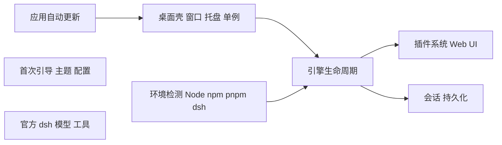
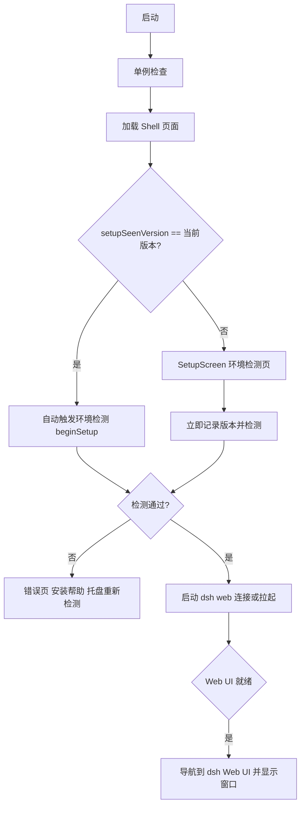

# 架构说明

本文描述 dsh-tauri-gui（下文简称「桌面壳」）的整体架构、外部依赖模型、启动流程、安全边界与更新通道。目标是让维护者与贡献者清楚「壳负责什么、dsh 负责什么」。

> 一句话：**桌面壳只做宿主与体验，dsh 才是能力的来源。** 安装包不内置任何运行时，壳只检测并使用你本机的外部 Node.js / npm / pnpm / dsh。

## 边界

- **桌面壳拥有**：原生窗口、系统托盘、单实例、外部环境检测、安装帮助、引擎进程管理、应用更新、首次引导、外观主题、配置持久化、日志脱敏。
- **dsh 拥有**：模型适配、工具执行、会话、沙箱、审批策略、插件系统、Web UI。会话日志是对话真源，桌面壳不另存一份对话状态。

## 外部依赖模型（无 bundled runtime）

dsh 需要 Node.js 运行时与 `@deepseek-ai/dsh` 包。桌面壳**不再打包、解压或热更新任何运行时**，只回答「环境是否存在、在哪里、版本是什么、能否运行」：

| 依赖 | 检测方式 | 默认门禁 |
| --- | --- | --- |
| Node.js | PATH 查找 + `node --version` | 必须存在且满足 `^22.19.0 || >=24` |
| npm / pnpm | PATH 查找 + `npm --version` / `pnpm --version` | 至少一个可用 |
| dsh | PATH 查找 + `dsh --version` | 必须存在（官方 `@deepseek-ai/dsh` 包） |

检测由 `detection/` 模块负责（`detection/aggregate.rs` 并行执行四项探测），产出标准化 `DependencyInfo` 行；全部通过后，`detection/aggregate::command_spec` 生成已验证的外部 `CommandSpec`（dsh 可执行文件路径 + 版本），引擎只接收该 `CommandSpec`。

**区域与源策略**：`geo/` 模块并行请求固定 HTTPS 端点做国家码共识（多数结果、冲突或失败返回 `unknown`，绝不阻塞启动）；`detection/sources.rs` 依据 `RegionCode` 选择 registry：国内 npmmirror、境外与未知官方源，用户可手动切换镜像。

## 启动与引导流程

主窗口初始 `visible: false`，以避免黑屏/白屏闪烁。加载顺序：

- **版本门禁**（`app/config.rs`）：新增 `setupSeenVersion` 字段——检测页**首次显示即写入**，因此即使依赖缺失或用户中途退出，同一版本的下一次启动也不会自动重复弹出；检测失败时进入错误/帮助状态，用户可通过**托盘 → 重新检测环境**手动重试。
- **引擎就绪判定**：监听 dsh 进程输出中的 `dsh web: <url>` 行，解析出 `http://127.0.0.1:<port>` 并记录到 `ready_url`；Webview 仅在来源命中白名单后才导航，随后显示窗口。
- **旧配置兼容**：历史版本中的 `runtimeMode` / `runtimeModeSelected` 字段被 serde 静默忽略（无 `deny_unknown_fields`），读取与保存均不会破坏既有配置。

## 引擎生命周期

`src-tauri/src/engine` 管理官方 `dsh web` 进程，按职责拆分：

- `command.rs`：由已验证 `CommandSpec` 构造命令（Windows `.cmd`/`.bat` shim 经 `cmd.exe /d /c`），统一追加 `web --no-open --port <port>`；
- `environment.rs`：`PATH` 前置 node/npm 目录、`DSH_HOME`（默认 `~/.dsh`）、`DSH_TELEMETRY_DISABLED`、`npm_config_registry`、`NO_COLOR=1`；
- `workspace.rs`：默认工作目录为用户主目录，可用 `defaultWorkspace` 覆盖；
- `process.rs`：子进程启动（隐藏控制台、参数数组）、stdout/stderr 泵取、退出监控；
- `lifecycle.rs`：**连接或拉起（connect-or-spawn）**——启动前探测端口上是否已有 `dsh web` 实例（`__DSH_BOOT__` 标记），有则直接连接；`restart_on_crash` 时 2 秒后自动重启；端口被占用（`EADDRINUSE`/`EACCES`）自动回退系统分配端口；停止时先置 `stopping` 标志，Windows 用 `taskkill /T /F` 结束整棵进程树；
- `web.rs`：端口探测、WebView 来源白名单与导航；
- `protocol.rs`：`dsh web: <url>` ready marker 解析。

## 安全边界

- **CSP**：`tauri.conf.json` 配置严格 CSP（`default-src 'self'`），开发模式额外放行 `localhost:1420`。
- **Webview 来源白名单**：`is_allowed_web_url()` 只允许加载 `ready_url` 记录的 `http://127.0.0.1:<port>`，以及固定 shell 来源；非白名单导航一律拒绝。
- **外部进程**：所有探测/安装/引擎命令均通过参数数组调用并隐藏控制台（`core/process.rs`），禁止拼接任意 shell 字符串。
- **应用更新校验**：`update/checker.rs` 从 GitHub 拉取 `latest.json`，下载地址必须属于官方 `github.com/KevinT-hub/dsh-tauri-gui/releases/download`；SHA-256 + minisign 签名双重校验；镜像仅作为无凭证下载代理。
- **geo 隐私**：`geo/` 不发送 token/cookie、不持久化 IP，仅保留进程内短 TTL 缓存的国家码。
- **配置原子写入**：`app/config.rs` 的 `save()` 用「临时文件 + `.bak` 备份」写入，主配置缺失时从最新 `.bak` 恢复。
- **日志脱敏**：`core/redact.rs` 对所有写入日志/转发前端的行做密钥脱敏。
- **安装确认边界**：`commands/setup.rs` 的 `install_dependency` 只执行**用户点击确认后**的安装命令，绝不在后台静默修改用户环境。

## 配置

配置文件位于 **shell home**（`~/.dsh-tauri-gui/config.json`），字段如下：

| 字段 | 默认 | 说明 |
| --- | --- | --- |
| `minimizeToTray` | `true` | 关闭窗口时最小化到托盘而非退出 |
| `autoStartEngine` | `true` | 启动后自动拉起 dsh 引擎 |
| `restartOnCrash` | `true` | 引擎崩溃后自动重启 |
| `telemetryDisabled` | `true` | 关闭 dsh 遥测（`DSH_TELEMETRY_DISABLED=1`） |
| `npmRegistry` | `https://registry.npmjs.org` | npm registry（geo 国内默认镜像，可手动覆盖） |
| `defaultWorkspace` | `null` | 引擎工作目录（默认用户主目录） |
| `uiTheme` | `system` | 外观：light / dark / system |
| `firstRunCompleted` | `false` | 首次启动是否完成 |
| `lastChecklistVersion` | `""` | 已确认过检查清单的版本 |
| `setupSeenVersion` | `""` | 已显示过检测页的版本（版本门禁） |
| `webuiPort` | `3080` | dsh Web UI 监听端口（0=系统分配） |
| `engineHome` | `null` | dsh 数据目录（默认 `~/.dsh`） |

## 目录布局

| 路径 | 用途 |
| --- | --- |
| `~/.dsh-tauri-gui/config.json` | 桌面壳配置 |
| `~/.dsh-tauri-gui/logs/` | 带脱敏的日志 |
| `~/.dsh/`（默认 `engineHome`） | 官方 dsh 的数据：会话、插件、配置等 |

> 切换 `engineHome` 可让桌面壳与你在用的官方 `dsh` CLI / 其他 GUI 共享同一套数据。`~/.dsh-tauri-gui/` 下**不再存在** runtime 目录。

## 更新通道

- **应用更新**：`release.yml` 在发布时生成 `latest.json` 并上传到 `update` 发布；稳定版写入 `latest.json`、预发布版写入 `latest-prerelease.json`。桌面壳启动时探测，仅在确有新版本时显示更新浮层。
- **dsh 核心**：不提供热更新——dsh 由用户的包管理器管理（`npm install -g @deepseek-ai/dsh`），检测页会在版本不满足时给出指引。
- **平台键**：`windows-x86_64` / `windows-aarch64` / `darwin-x86_64` / `darwin-aarch64` / `linux-x86_64` / `linux-aarch64`。

## 相关文档

- [安装说明](INSTALLATION.md)
- [使用指南](USER_GUIDE.md)
- [常见问题](FAQ.md)
- [插件兼容性](PLUGIN_COMPATIBILITY.md)
- [发布与更新通道](RELEASE.md)
- [贡献与开发](../CONTRIBUTING.md)
