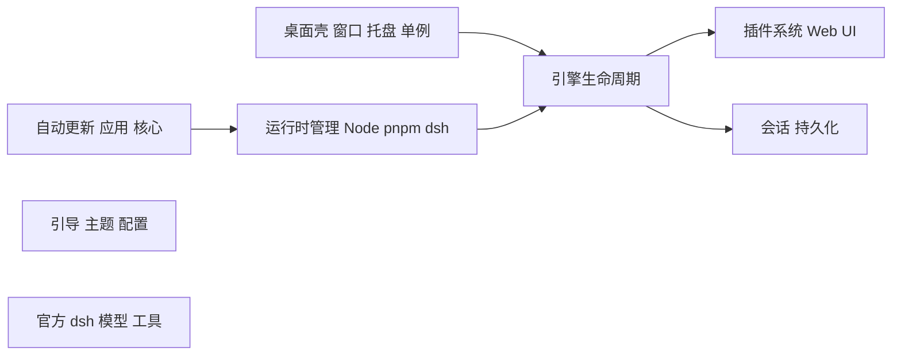
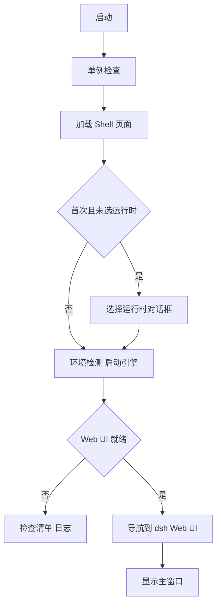

# 架构说明

本文描述 DeepSeek Harness Tauri Desktop（下文简称「桌面壳」）的整体架构、运行时模型、启动流程、安全边界与更新通道。目标是让维护者与贡献者清楚「壳负责什么、dsh 负责什么」。

> 一句话：**桌面壳只做宿主与体验，dsh 才是能力的来源。** 我们对上游 `@deepseek-ai/dsh` 不做任何修改。

## 边界

- **桌面壳拥有**：原生窗口、系统托盘、单实例、运行时下载/校验/解压、引擎进程管理、应用与核心的更新、首次引导、外观主题、配置持久化、日志脱敏。
- **dsh 拥有**：模型适配、工具执行、会话、沙箱、审批策略、插件系统、Web UI。会话日志是对话真源，桌面壳不另存一份对话状态。

## 运行时（Runtime）

dsh 需要 Node.js 运行时与 `@deepseek-ai/dsh` 包。桌面壳支持两种模式：

| 模式 | 来源 | 适用人群 |
| --- | --- | --- |
| `bundled`（默认，推荐） | 应用内置的 Node + pnpm + dsh（打包进安装包） | 所有人，开箱即用、版本固定 |
| `system` | 复用 PATH 中的 node / npm / dsh | 自行管理 Node/dsh 的进阶用户 |

固定版本写在 `scripts/runtime-versions.json`（当前 Node 22.19.0 / pnpm 11.7.0 / dsh 0.1.0-rc.6），由 `scripts/prepare-runtime.mjs` 在打包与开发时统一拉取。

### 内置运行时的打包

- 从 npmmirror（回退 npmjs）下载官方 Node 归档，并用 `SHASUMS256.txt` 校验；
- 用捆绑的 npm 安装 `@deepseek-ai/dsh` 与 pnpm，registry 默认 `https://registry.npmmirror.com`（回退 `registry.npmjs.org`）；
- 裁剪非必要文件（文档、source map、类型声明、调试符号、非本平台 prebuild），显著减小体积；
- 打包为 `src-tauri/resources/runtime.tar.gz` 并在同目录写入 `runtime.json`（记录 dsh / node / pnpm 版本）。

### 解压与一致性

`ensure_runtime()` 采用**基于存在性的回退**：

- 本地运行时已存在且可用 → 直接复用，**绝不**强制重新下载/解压；
- 内置 Node/pnpm 版本与本地 `runtime.json` 不一致时，仅增量同步 `node/`、`tools/` 子树，保留热更新的 `app/`；
- 本地缺失或损坏时才从内置归档解压（带临时目录 + 备份回滚）。

## 启动与引导流程

主窗口初始 `visible: false`，以避免黑屏/白屏闪烁。加载顺序：

- **选择运行时对话框**（`RuntimeChoiceDialog.tsx`）：仅在首次启动、且 `runtimeModeSelected == false` 时出现，选择后写入配置并触发检测。
- **检查清单 / BootScreen**：在「首次启动」或「版本升级后首次启动」显示（`checklist_required`），用于环境检测与必要提示；日常使用不会再打扰。
- **引擎就绪判定**：监听 dsh 进程输出中的 `dsh web: <url>` 行，解析出 `http://127.0.0.1:<port>` 并记录到 `ready_url`；Webview 仅在来源命中白名单后才导航，随后显示窗口。

`enter_harness` 命令标记检查清单完成并打开 Web UI；`shell_ready` 在 shell 页面绘制完成后才揭示检查清单窗口。

## 引擎生命周期

`src-tauri/src/engine` 管理官方 `dsh web` 进程：

- 启动命令：`<node> <dsh-bin> web --no-open --port <port>`，默认端口 3080（可在配置中修改，0 表示系统分配）。`--no-open` 禁止 dsh 将同一地址交给系统默认浏览器，由 Tauri WebView 负责呈现。
- 环境变量：`DSH_HOME`（默认 `~/.dsh`，可覆盖）、`DSH_TELEMETRY_DISABLED`（默认 `1`）、`npm_config_registry`、`NO_COLOR=1`，以及把 bundled 的 node/pnpm/dsh 注入 `PATH`。
- **连接或拉起（connect-or-spawn）**：启动前先探测端口上是否已有 `dsh web` 实例（通过 `__DSH_BOOT__` 标记识别）；有则直接连接，避免重复拉起导致配置/会话分散。
- **监控与自重启**：独立线程泵取 stdout/stderr 日志并监控退出码；`restart_on_crash` 为真时 2 秒后自动重启。若端口被占用（`EADDRINUSE`/`EACCES`），自动回退到系统分配端口。
- **停止**：退出或切换运行时时，先置 `stopping` 标志再结束进程（Windows 用 `taskkill /T /F` 兜底），避免子进程成为孤儿占用端口。

## 安全边界

- **CSP**：`tauri.conf.json` 中配置严格的 CSP（`default-src 'self'`），开发模式额外放行 `localhost:1420`。
- **Webview 来源白名单**：`is_allowed_web_url()` 只允许加载 `ready_url` 记录的 `http://127.0.0.1:<port>`，以及固定的 shell 来源（`tauri://localhost`、`https://tauri.localhost`、`http://localhost:1420`）。非白名单导航一律拒绝——即使有游离的本地服务或受污染的引擎日志行也无法劫持窗口。
- **应用更新校验**：`update/checker.rs` 从 GitHub 拉取 `latest.json`，下载地址必须属于官方 `github.com/KevinT-hub/dsh-tauri-gui/releases/download`；再用 **SHA-256**（写入 `latest.json`）+ **Tauri minisign 签名**双重校验。镜像仅作为「无凭证的下载代理」，从不接收 token/cookie。
- **dsh 核心热更新**：`engine/runtime_update.rs` 在 `.app-staging-*` 目录暂存安装，校验产物后再与旧 `app/` 交换，并保留 `.app-old-*` 备份，确保中途失败可回滚。
- **配置原子写入**：`app/config.rs` 的 `save()` 用「临时文件 + `.bak` 备份」写入，主配置缺失时从最新 `.bak` 恢复。
- **日志脱敏**：`core/redact.rs` 对所有写入日志/转发前端的行做密钥脱敏；`DSH_HOME`、`DEEPSEEK_API_KEY` 等敏感内容不会明文落盘。

## 配置

配置文件位于 **shell home**（`~/.dsh-tauri-gui/config.json`），字段如下：

| 字段 | 默认 | 说明 |
| --- | --- | --- |
| `minimizeToTray` | `true` | 关闭窗口时最小化到托盘而非退出 |
| `autoStartEngine` | `true` | 启动后自动拉起 dsh 引擎 |
| `restartOnCrash` | `true` | 引擎崩溃后自动重启 |
| `telemetryDisabled` | `true` | 关闭 dsh 遥测（`DSH_TELEMETRY_DISABLED=1`） |
| `npmRegistry` | `https://registry.npmmirror.com` | npm 镜像（回退 npmjs） |
| `defaultWorkspace` | `null` | 引擎工作目录（默认用户主目录） |
| `uiTheme` | `system` | 外观：light / dark / system |
| `firstRunCompleted` | `false` | 首次启动是否完成 |
| `lastChecklistVersion` | `""` | 已确认过检查清单的版本 |
| `webuiPort` | `3080` | dsh Web UI 监听端口（0=系统分配） |
| `engineHome` | `null` | dsh 数据目录（默认 `~/.dsh`） |
| `runtimeMode` | `bundled` | 运行时来源：bundled / system |
| `runtimeModeSelected` | `false` | 用户是否已显式选择运行时 |

## 目录布局

| 路径 | 用途 |
| --- | --- |
| `~/.dsh-tauri-gui/config.json` | 桌面壳配置 |
| `~/.dsh-tauri-gui/runtime/` | 内置运行时（node / app / tools / runtime.json） |
| `~/.dsh-tauri-gui/logs/` | 带脱敏的日志 |
| `~/.dsh/`（默认 `engineHome`） | 官方 dsh 的数据：会话、插件、配置等 |

> 切换 `engineHome` 可让桌面壳与你在用的官方 `dsh` CLI / 其他 GUI 共享同一套数据。

## 更新通道

- **应用更新**：`release.yml` 在发布时生成 `latest.json` 并上传到 `update` 发布；稳定版写入 `latest.json`、预发布版写入 `latest-prerelease.json`。桌面壳启动时探测，仅在确有新版本时显示更新浮层。
- **dsh 核心更新**：在 bundled 模式下，`check_runtime_update` / `apply_runtime_update` 查询 npm registry 最新 `@deepseek-ai/dsh` 并就地热更新（system 模式下禁用，需用系统包管理器更新）。
- **平台键**：`windows-x86_64` / `windows-aarch64` / `darwin-x86_64` / `darwin-aarch64` / `linux-x86_64` / `linux-aarch64`。

## 相关文档

- [使用指南](USER_GUIDE.md)
- [常见问题](FAQ.md)
- [贡献与开发](../CONTRIBUTING.md)
